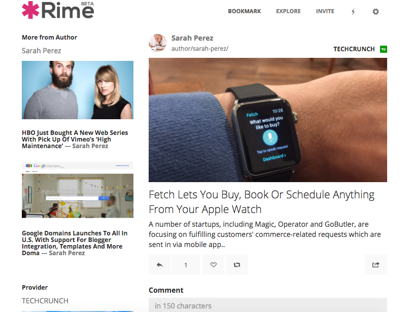

#### Features

- **Unique Public Profile** 
  
  More and more social networks are evolving every year eg. Vine, Tumblr, Instagram, Ello, Tsu, Snapchat, etc. The result is scattered content and multiple online identities of people. It consumes a lot of time to follow people on multiple platforms and makes very difficult to get aII updates.
  
  - Rime connects multiple social media platforms to one unique Rime profile. [https://rime.co/@girish/about](https://rime.co/@girish/about)
  - Brings user’s publicly shared content from connected platforms to one unified timeline, example: [https://rime.co/@rime](https://rime.co/@rime)
  
  ​
  
-  **Guest Public profile (Wikipedia for Social Profiles)**
  
  Users  can create a guest profile of any artist/brands/celebrity, who is not present in Rime. Users can invite other users/moderators in rime to edit guest profile. 
  
  - This helps users to follow any brand’s/celebrity’s social media activities on various platforms from one place, Rime.
  
  
  - Just like in Wikipedia, where anyone can create others wiki profiles, Rime gives power to users to create and follow their favourite ones if they are not yet in Rime. Examples: [https://rime.co/@taylorswift13](https://rime.co/@taylorswift13) 
  
  
  - More profiles can be explored here https://rime.co/guest/search							
  
- **People and Content** **search** 
  
  We are connecting the dots of the internet. Every content on the internet has information like Author, provider of content. We are connecting each and every content with its original author and providers. It helps to give better search, as well as more information about content and its creator.
  
  - For example :https://rime.co/url/92849
    
    ​
    
  - Explore awesome people and content, and get to know what they are sharing on various platforms
  
- **Easy content sharing and people following**
  
  No need to follow people across multiple platforms to keep up with their social media activities, just follow the user on Rime and see the complete view of users’ social media interactions. 
  
  - For example Adele, her social media presence is quite distributed on Youtube, Instagram, Google+, twitter. It's difficult to follow her up on all these places, but you can get her activities in Rime profile [https://rime.co/@Adele](https://rime.co/@Adele).
  - You can share the interesting content you found in rime to other platforms like Facebook, Twitter, Tumblr etc. 		
  
   